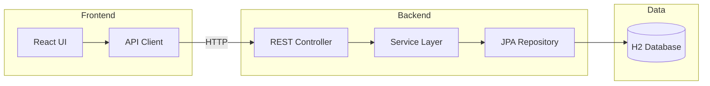
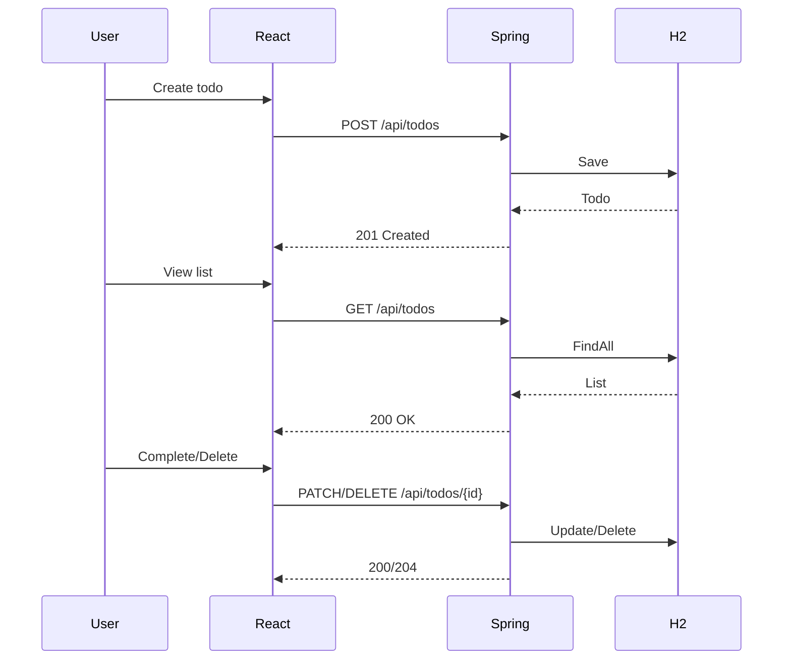
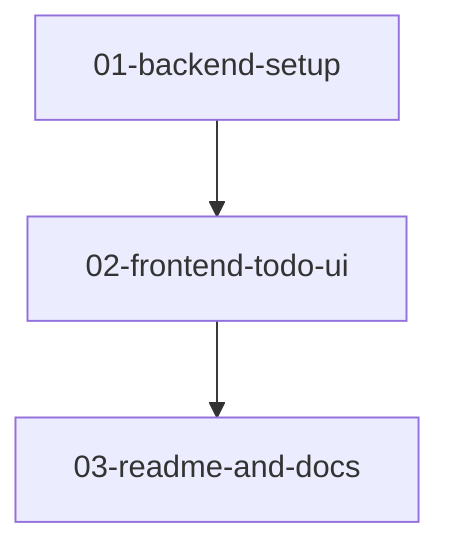

# Todo App Boilerplate — Implementation Plan Overview

## High-Level Architecture

The Todo App consists of two independent projects:

- **Backend** (`backend/`): Java Spring Boot REST API with H2 embedded database
- **Frontend** (`frontend/`): React JS SPA consuming the backend API



## System Flow



## Directory Structure

```
<repo-root>/
├── backend/                    # Spring Boot project
│   ├── src/
│   │   ├── main/
│   │   │   ├── java/.../TodoApplication.java
│   │   │   ├── java/.../Todo.java
│   │   │   ├── java/.../TodoRepository.java
│   │   │   ├── java/.../TodoController.java
│   │   │   └── resources/
│   │   │       ├── application.properties
│   │   │       └── schema.sql (optional)
│   │   └── test/
│   └── pom.xml
├── frontend/                   # React project
│   ├── src/
│   │   ├── App.jsx
│   │   ├── components/
│   │   └── ...
│   ├── package.json
│   └── vite.config.js
└── README.md
```

## Step Dependencies



| Step | Focus | AC-IDs |
|------|-------|--------|
| 01-backend-setup | Spring Boot + H2 + Todo API | AC-2, AC-3, AC-5, AC-6, AC-7, AC-9 |
| 02-frontend-todo-ui | React + Todo UI + API integration | AC-1, AC-8, AC-10 |
| 03-readme-and-docs | Documentation | AC-4, AC-10 |

## Prerequisites

- **Backend**: JDK 17+ (or 11+), Maven 3.6+
- **Frontend**: Node.js 18+, npm or yarn
- No external database required (H2 embedded)

## Technical Decisions

| Decision | Rationale |
|----------|-----------|
| H2 in-memory | AC-9: No external DB setup; runs out of the box |
| CORS enabled for localhost | Frontend can call backend during dev without proxy |
| Separate `frontend/` and `backend/` | AC-1, AC-2: Clear separation of concerns |
| `@RestController` + `@Repository` | Standard Spring REST + JPA pattern |
| Vite for React | Fast dev experience; can use CRA if preferred |
| Base path `/api` | Aligns with spec API contracts |
