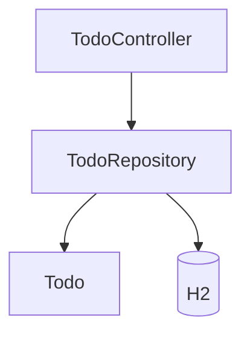

# Step 01 — Backend Setup (Spring Boot + H2 + Todo API)

## Context

This step creates the backend project from scratch. No prior steps exist. The backend will expose a REST API for Todo CRUD operations and use H2 as an embedded database so the app runs without external DB setup (AC-9).

## Tasks

### Backend

1. Create Spring Boot project structure under `backend/` with Maven (`pom.xml`).
2. Add dependencies: Spring Boot Web, Spring Data JPA, H2.
3. Configure H2 in `application.properties` (in-memory or file-based).
4. Create `Todo` entity with fields: `id`, `title`, `description`, `completed`, `createdAt`.
5. Create `TodoRepository` extending `JpaRepository<Todo, Long>`.
6. Create `TodoController` with base path `/api` and endpoints:
   - `GET /api/todos` — list all todos
   - `POST /api/todos` — create todo (body: `{ title, description? }`)
   - `PATCH /api/todos/{id}` — update `completed` (body: `{ completed }`)
   - `DELETE /api/todos/{id}` — delete todo
7. Add CORS configuration for `http://localhost:5173` (Vite default) and `http://localhost:3000`.
8. Handle edge cases: empty title → default "Untitled"; 404 for non-existent id on PATCH/DELETE.

## Acceptance Criteria

- [ ] **AC-2:** `backend/` directory exists with Spring Boot project structure (`pom.xml` with Spring Boot).
- [ ] **AC-3:** H2 is in `pom.xml` dependencies; `application.properties` configures H2 datasource.
- [ ] **AC-5:** POST to `/api/todos` with `{ title, description? }` returns 201 and created todo.
- [ ] **AC-6:** GET `/api/todos` returns list of todos (empty array when none).
- [ ] **AC-7:** PATCH `/api/todos/{id}` updates `completed`; DELETE returns 204; 404 for non-existent id.
- [ ] **AC-9:** App runs without external DB (H2 in-memory or embedded file).

## Commands to Run

```bash
cd backend && mvn clean compile
cd backend && mvn spring-boot:run
# Verify: curl http://localhost:8080/api/todos
```

## Files to Modify

| File | Action | Purpose |
|------|--------|---------|
| `backend/pom.xml` | create | Maven project with Spring Boot, JPA, H2 |
| `backend/src/main/java/.../TodoApplication.java` | create | Spring Boot main class |
| `backend/src/main/java/.../Todo.java` | create | JPA entity |
| `backend/src/main/java/.../TodoRepository.java` | create | JPA repository |
| `backend/src/main/java/.../TodoController.java` | create | REST controller |
| `backend/src/main/java/.../config/WebConfig.java` | create | CORS config |
| `backend/src/main/resources/application.properties` | create | H2 datasource config |

## Architecture / Diagrams



## Technical Decisions

| Decision | Rationale |
|----------|-----------|
| H2 in-memory (`jdbc:h2:mem:tododb`) | Zero config; data resets on restart; AC-9 compliant |
| `@RestController` + `@RequestMapping("/api")` | Matches spec API base path |
| `Long` for id | Standard for JPA entities |
| Empty title → "Untitled" | Spec edge case: reject or default |
| CORS for localhost:5173, :3000 | Frontend dev servers |

## Code Examples / Files

### Todo Entity (excerpt)

```java
@Entity
@Table(name = "todos")
public class Todo {
    @Id @GeneratedValue(strategy = GenerationType.IDENTITY)
    private Long id;
    private String title;
    private String description;
    private boolean completed = false;
    @Column(name = "created_at")
    private LocalDateTime createdAt = LocalDateTime.now();
    // getters/setters
}
```

### application.properties (excerpt)

```properties
spring.datasource.url=jdbc:h2:mem:tododb
spring.datasource.driverClassName=org.h2.Driver
spring.datasource.username=sa
spring.datasource.password=
spring.jpa.database-platform=org.hibernate.dialect.H2Dialect
spring.h2.console.enabled=true
```

### API Response Shape

```json
{
  "id": 1,
  "title": "Buy milk",
  "description": "From the store",
  "completed": false,
  "createdAt": "2025-03-16T10:00:00"
}
```

## Docs Updates

None for this step.

## Commit Message

```
feat(backend): add Spring Boot + H2 + Todo REST API

- Spring Boot project with JPA and H2
- Todo entity, repository, controller
- GET/POST/PATCH/DELETE /api/todos
- CORS for local frontend dev
```
