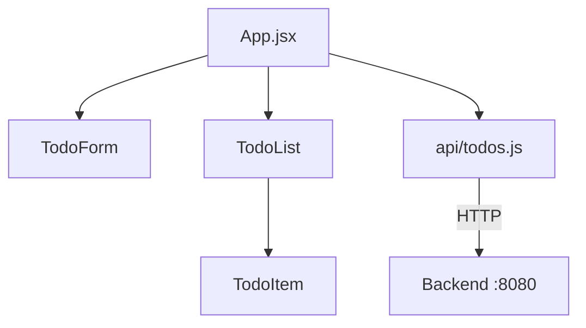

# Step 02 — Frontend Todo UI (React + API Integration)

## Context

This step builds on **01-backend-setup**. The backend exposes `/api/todos`. Here we create the React frontend project and implement the Todo UI that calls the backend API. Frontend and backend run independently (AC-10).

## Tasks

### Frontend

1. Create React project under `frontend/` using Vite (`npm create vite@latest frontend -- --template react`).
2. Add project structure: `src/App.jsx`, `src/components/`, `src/api/`.
3. Create API client to call `http://localhost:8080/api/todos`:
   - `fetchTodos()`, `createTodo(title, description)`, `updateTodo(id, completed)`, `deleteTodo(id)`.
4. Create UI components:
   - Todo list (display todos; empty state when none).
   - Todo form (input for title, optional description; submit creates todo).
   - Todo item (title, description, completed checkbox, delete button).
5. Wire components to API: load on mount, create on submit, toggle complete via PATCH, delete via DELETE.
6. Handle loading and error states (minimal: show message or fallback).

## Acceptance Criteria

- [ ] **AC-1:** `frontend/` directory exists with React project structure (`package.json` with React dependency).
- [ ] **AC-8:** Frontend UI renders todos and provides controls for create, view, and complete/delete.
- [ ] **AC-10:** Frontend starts via documented command; can run independently (backend must be running for API).

## Commands to Run

```bash
cd frontend && npm install
cd frontend && npm run build
cd frontend && npm run dev
# With backend running: verify UI at http://localhost:5173
```

## Files to Modify

| File | Action | Purpose |
|------|--------|---------|
| `frontend/package.json` | create | React + Vite deps |
| `frontend/vite.config.js` | create | Vite config (optional proxy) |
| `frontend/index.html` | create | Entry HTML |
| `frontend/src/main.jsx` | create | React entry |
| `frontend/src/App.jsx` | create | Main app, state, API wiring |
| `frontend/src/api/todos.js` | create | API client functions |
| `frontend/src/components/TodoList.jsx` | create | List + empty state |
| `frontend/src/components/TodoForm.jsx` | create | Create form |
| `frontend/src/components/TodoItem.jsx` | create | Single todo with complete/delete |
| `frontend/src/App.css` | create | Basic styles |

## Architecture / Diagrams



## Technical Decisions

| Decision | Rationale |
|----------|-----------|
| Vite + React | Fast dev; modern tooling |
| `fetch` for API | No extra HTTP library |
| API base URL `http://localhost:8080` | Configurable via env if needed |
| Empty state when no todos | AC-8 edge case: UI shows empty state, not error |

## Code Examples / Files

### api/todos.js (excerpt)

```javascript
const API_BASE = 'http://localhost:8080/api';

export async function fetchTodos() {
  const res = await fetch(`${API_BASE}/todos`);
  return res.json();
}

export async function createTodo(title, description) {
  const res = await fetch(`${API_BASE}/todos`, {
    method: 'POST',
    headers: { 'Content-Type': 'application/json' },
    body: JSON.stringify({ title, description }),
  });
  return res.json();
}

export async function updateTodo(id, completed) {
  const res = await fetch(`${API_BASE}/todos/${id}`, {
    method: 'PATCH',
    headers: { 'Content-Type': 'application/json' },
    body: JSON.stringify({ completed }),
  });
  return res.json();
}

export async function deleteTodo(id) {
  await fetch(`${API_BASE}/todos/${id}`, { method: 'DELETE' });
}
```

### App.jsx (pseudocode)

```jsx
// State: todos, loading, error
// useEffect: fetchTodos on mount
// Handlers: handleCreate, handleToggle, handleDelete
// Render: TodoForm, TodoList
```

## Docs Updates

None for this step.

## Commit Message

```
feat(frontend): add React Todo UI with API integration

- Vite + React project
- Todo list, form, item components
- API client for CRUD
- Empty state when no todos
```
